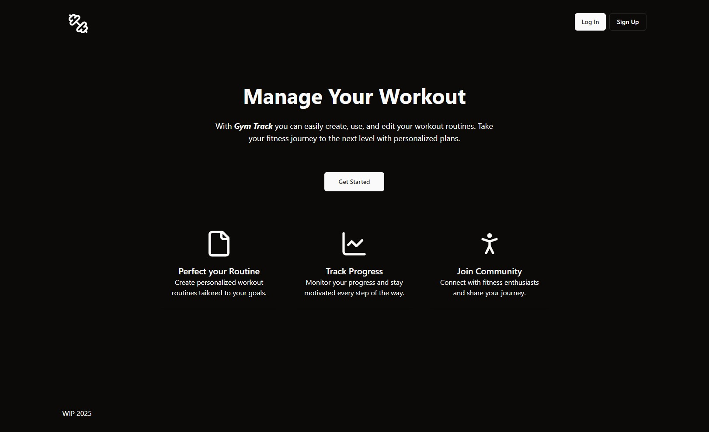
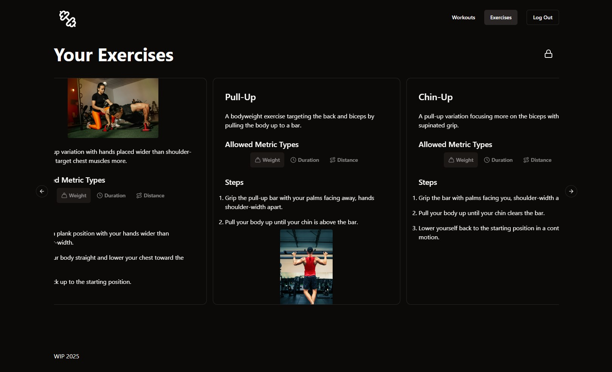
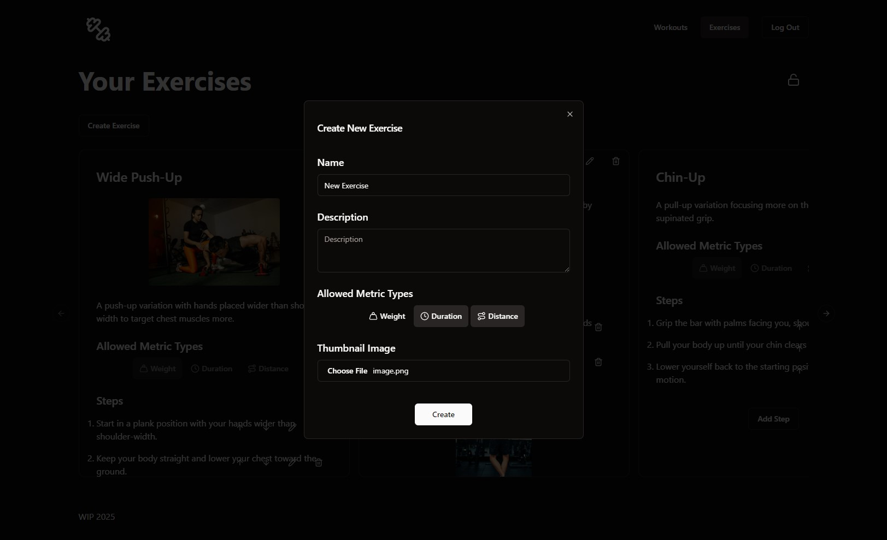
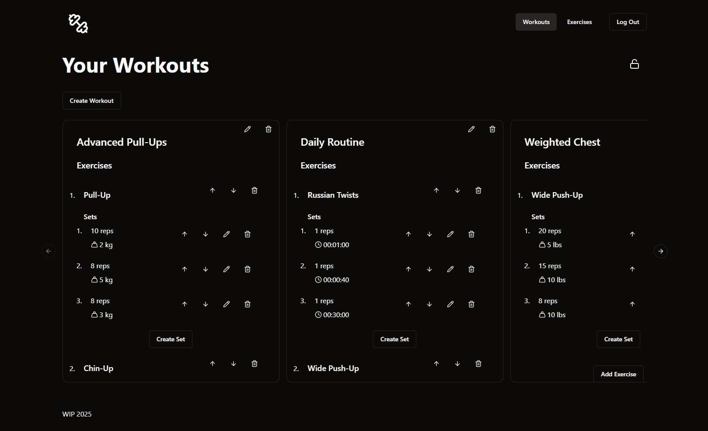

# Gym Track

## About

`.NET`, `Vue.js` web app for managing (and, soon, tracking) workout routines and exercises.

## Getting Started

This is a mono repo and includes everything you need to deploy this app.

### Backend

`GymTrackApi` directory contains the backend source code and uses `.NET 8`. Instructions on configuring the project _coming soon_.

### Frontend

`gym-track` directory contains the frontend source code and uses `Vue.js`.

1. Use [mkcert](https://mkcert.dev/) to generate certificates for HTTPS during development. The certificates should be named `localhost-key.pem` and `localhost.pem`, and put in `gym-track/certs/`.
2. `npm install`
3. `npm run dev`

## Gallery

